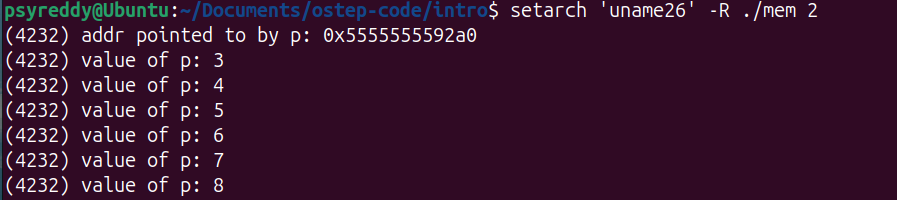
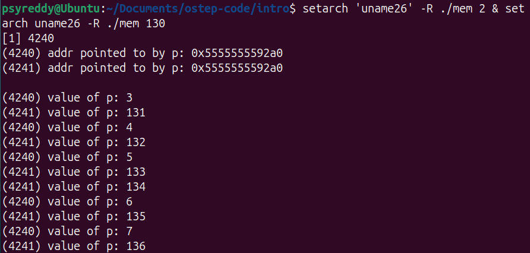

# 2.0 Introduction

**What does running a program mean?**

The processor **Fetches** an instruction from memory, **Decodes** the instruction (convert it into a way that CPU can understand), **Executes** the instruction. This is a simple [Von Neumann model of computing](https://www.geeksforgeeks.org/computer-organization-von-neumann-architecture/) 

***OS***
- Responsible for making it easy to run many programs at once
- Allows programs to use shared memory
- Enables programs to use I/O devices

The primary way OS does this is through *virtualization*. The OS takes the physical resources and then transforms them to easy to use virtual form. Thus we refer OS as <ins>Virtual Machine</ins>  sometimes. Since we can see that OS is allowing many programs to run at same time using virtualization, It is indeed managing the resources (sharing memory, CPU, disk) between programs. OS is sometimes referred to as <ins>Resource Manager</ins>

For the users to make use of OS (such as running a program, or allocating memory, or accessing a file), the OS provides some APIs that you can call. A typical OS exports a few hundreds **system calls** that are available for applications to use.

# 2.1 Virtualizing The CPU

```c
#include <stdio.h>
#include <stdlib.h>
#include "common.h"

int main(int argc, char *argv[])
{
    if (argc != 2) {
		fprintf(stderr, "usage: cpu <string>\n");
		exit(1);
    }
    char *str = argv[1];

    while (1) {
		printf("%s\n", str);
		Spin(1);
    }
    return 0;
}

```

The above program just prints the string that is given as input by user and waits for seconds and the prints again until user interrupts it (^c). Now let us say our computer has a single processor.

Now lets compile the program using command `gcc -o cpu cpu.c -Wall`. This commands creates an executable on the disk named `cpu`. Now run the program using command `./cpu "A"`. Now our executable is converted into a process (more on this in coming chapters). 

Now lets create multiple instances of the same process by running the command `./cpu "A" & ./cpu " B" & ./cpu "  C" &` (The `&` creates the process before it and makes terminal available for next command). Now the three processes run parallelly. 

Wait WTF is happening the single CPU is running multiple processes at the same time? Yes! indeed, The Operating System with help from hardware creates an illusion that the system has a very large number of virtual CPUs. The thing to note here is each process will be in an illusion that it has the whole CPU resource for itself. For the user to tell the OS which program to run, stop we need some interfaces (APIs) to communicate to OS.

# 2.2 Virtualizing Memory

```c
#include <unistd.h>
#include <stdio.h>
#include <stdlib.h>
#include "common.h"

int main(int argc, char *argv[]) {
    if (argc != 2) { 
		fprintf(stderr, "usage: mem <value>\n"); 
		exit(1); 
    } 
    int *p; 
    p = malloc(sizeof(int));
    assert(p != NULL);
    printf("(%d) addr pointed to by p: %p\n", (int) getpid(), p);
    *p = atoi(argv[1]); // assign value to addr stored in p
    while (1) {
		Spin(1);
		*p = *p + 1;
		printf("(%d) value of p: %d\n", getpid(), *p);
	}
    return 0;
}
```

This program at first step prints the process id and the address allocated through malloc and later it keeps incrementing the value present at that address by 1 until stopped.

Now lets compile the program using the command `gcc -o mem mem.c -Wall`. As a first step lets run the program (`./mem 1`) . After this run multiple instances of same program (`./mem 143 & ./mem 1`). Now observe the output.



*Output when you run one instance of the program.*



*Output when you run 2 instances of the program*


