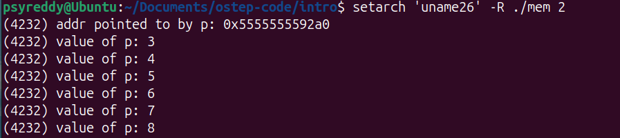
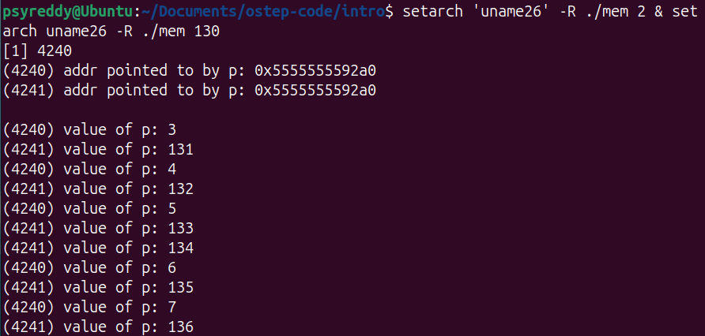
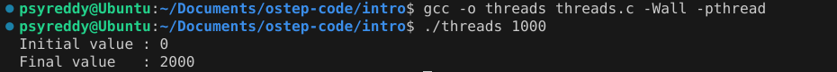
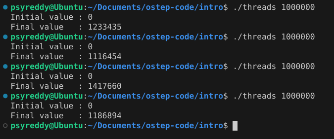

# Introduction

[Reference](https://pages.cs.wisc.edu/~remzi/OSTEP/intro.pdf)

**What does running a program mean?**

The processor **Fetches** an instruction from memory, **Decodes** the instruction (convert it into a way that CPU can understand), **Executes** the instruction. This is a simple [Von Neumann model of computing](https://www.geeksforgeeks.org/computer-organization-von-neumann-architecture/) 

***OS***
- Responsible for making it easy to run many programs at once
- Allows programs to use shared memory
- Enables programs to use I/O devices

The primary way OS does this is through *virtualization*. The OS takes the physical resources and then transforms them to easy to use virtual form. Thus we refer OS as <ins>Virtual Machine</ins>  sometimes. Since we can see that OS is allowing many programs to run at same time using virtualization, It is indeed managing the resources (sharing memory, CPU, disk) between programs. OS is sometimes referred to as <ins>Resource Manager</ins>

For the users to make use of OS (such as running a program, or allocating memory, or accessing a file), the OS provides some APIs that you can call. A typical OS exports a few hundreds **system calls** that are available for applications to use.

## 2.1 Virtualizing The CPU

```c
#include <stdio.h>
#include <stdlib.h>
#include "common.h"

int main(int argc, char *argv[])
{
    if (argc != 2) {
		fprintf(stderr, "usage: cpu <string>\n");
		exit(1);
    }
    char *str = argv[1];

    while (1) {
		printf("%s\n", str);
		Spin(1);
    }
    return 0;
}

```

The above program just prints the string that is given as input by user and waits for seconds and the prints again until user interrupts it (^c). Now let us say our computer has a single processor.

Now lets compile the program using command `gcc -o cpu cpu.c -Wall`. This commands creates an executable on the disk named `cpu`. Now run the program using command `./cpu "A"`. Now our executable is converted into a process (more on this in coming chapters). 

Now lets create multiple instances of the same process by running the command `./cpu "A" & ./cpu " B" & ./cpu "  C" &` (The `&` creates the process before it and makes terminal available for next command). Now the three processes run parallelly. 

Wait WTF is happening the single CPU is running multiple processes at the same time? Yes! indeed, The Operating System with help from hardware creates an illusion that the system has a very large number of virtual CPUs. The thing to note here is each process will be in an illusion that it has the whole CPU resource for itself. For the user to tell the OS which program to run, stop we need some interfaces (APIs) to communicate to OS.

## 2.2 Virtualizing Memory

```c
#include <unistd.h>
#include <stdio.h>
#include <stdlib.h>
#include "common.h"

int main(int argc, char *argv[]) {
    if (argc != 2) { 
		fprintf(stderr, "usage: mem <value>\n"); 
		exit(1); 
    } 
    int *p; 
    p = malloc(sizeof(int));
    assert(p != NULL);
    printf("(%d) addr pointed to by p: %p\n", (int) getpid(), p);
    *p = atoi(argv[1]); // assign value to addr stored in p
    while (1) {
		Spin(1);
		*p = *p + 1;
		printf("(%d) value of p: %d\n", getpid(), *p);
	}
    return 0;
}
```

This program at first step prints the process id and the address allocated through malloc and later it keeps incrementing the value present at that address by 1 until stopped.

Now lets compile the program using the command `gcc -o mem mem.c -Wall`. As a first step lets run the program (`./mem 1`) . After this run multiple instances of same program (`./mem 143 & ./mem 1`). Now observe the output.

<figure style="text-align: center;">
  
  <figcaption>Output when you run one instance of the program.</figcaption>
</figure>


<figure style="text-align: center;">
  
  <figcaption>Output when you run two instances of the program.</figcaption>
</figure>


We can observe that the first time when we run the program once, the malloc function allocates the address pointed by the pointer `0x5555555592a0` and the value at that location is updated every second.

Now carefully observe the second output. We can see that program with pid `4240` (p1) and program with pid `4241` (p2) were allocated the same address space pointed by pointer `0x5555555592a0` and p1 is saying that the value stored at that address is 3 initially and its updating the same, while p2 is saying that the value stored at that address is 131 initially and its updating the same. 

How is this even possible? Two different programs are pointing to same address and modifying the value at that position. This is also part of the illusion that is being created by OS. Here each program is running in its own virtual private memory instead of running in the same physical memory with the other program. 

In simpler terms, Each program has access to its own <ins>virtual private address space</ins> which the OS maps to the physical memory of machine. An address space of one program will not interfere with the address space of other. 

## 2.3 Concurrency

```c
#include <stdio.h>
#include <stdlib.h>
#include "common.h"
#include "common_threads.h"

volatile int counter = 0; 
int loops;

void *worker(void *arg) {
    int i;
    for (i = 0; i < loops; i++) {
	    counter++;
    }
    return NULL;
}

int main(int argc, char *argv[]) {
    if (argc != 2) { 
      fprintf(stderr, "usage: threads <loops>\n"); 
      exit(1); 
    } 
    loops = atoi(argv[1]);
    pthread_t p1, p2;
    printf("Initial value : %d\n", counter);
    Pthread_create(&p1, NULL, worker, NULL); 
    Pthread_create(&p2, NULL, worker, NULL);
    Pthread_join(p1, NULL);
    Pthread_join(p2, NULL);
    printf("Final value   : %d\n", counter);
    return 0;
}
```

As we can see in above two cases that OS is running many threads at the same time. As of now we can consider two threads as two different processes but sharing the same piece of virtual memory. 

Now lets have a look at the above code. The above piece of code creates two threads which will start working on the same function `worker` concurrently. This implies if we set the value of `loops` to `N`, ideally the value of `counter` should be `2N` since two different threads are independently incrementing the value of `counter`. Now lets try running the same program for different values of `N`.

Compile the program using `gcc -o threads threads.c -Wall -pthread`. And run the program using `./threads <loops>`

<figure style="text-align: center;">
  
  <figcaption>Output when value of <code>loop</code> is 1000</figcaption>
</figure>


<figure style="text-align: center;">
  
  <figcaption>Output when value of <code>loop</code> is 1000000</figcaption>
</figure>

From the first output we can see that the two threads have done their job and we get the output value as 2000. Coming to the second case where loops was set to 1000000, we see that the output of the program is not 2000000. Not only this it was neither consistent.

The above phenomenon happens due to the fact that two threads will be sharing the same piece of virtual memory and the operation of the worker (which is adding `1` to the counter) is not atomic. We will learn more about this in coming $2^{nd}$ pillar of OS **concurrency**.

## 2.4 Persistence


